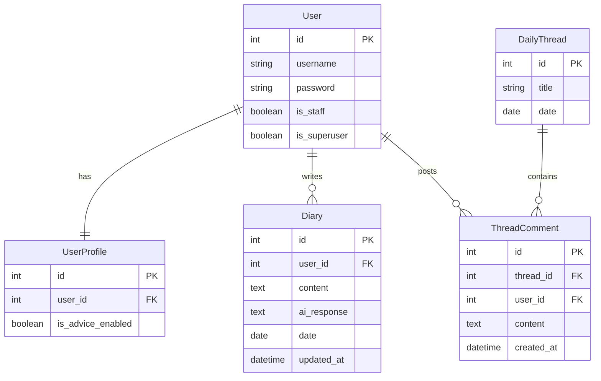

# my pace

**「書く時間は自分だけ。読む時間は明日へのエール。」** 日々の体調や感情を記録し、専属のAIカウンセラーが寄り添う、セルフケアのための健康日記アプリケーション。

---

## 1. プロジェクト概要
「my pace」は、忙しい日常の中で自分のコンディションを整える時間を提供するために開発されました。
あえて「AIの返信を翌日に届ける」という設計にすることで、書く瞬間の没入感と、翌朝に自分を客観的に振り返る癒やしのサイクルを生み出します。また、掲示板というコミュニティ要素があることで、日記という内省的なアプリでありながらも孤独を感じません。

## 2. 機能一覧
- **ユーザー認証**: 新規登録、ログイン・ログアウト機能。
- **AI健康日記**: 
    - 24時まで何度でも更新可能な当日日記。
    - Google Gemini API によるパーソナライズされたカウンセリング。
    - **日付またぎ保存機能**: 書き始めの時刻を優先して保存する救済ロジック。
- **アーカイブ（振り返り）**: 
    - 日記一覧と詳細表示。
    - 当日の詳細では、AIからの返信は隠される。
    - 全文検索および期間絞り込み機能。
- **今日の話題（掲示板）**:
    - 管理者アカウントで話題を管理。 
    - 毎日更新される共通テーマでのユーザー交流。
    - リアルタイム感を演出するチャット形式のUI。
- **AI設定**: 
    - 返信スタンスの切り替え（共感のみ / 共感＋健康アドバイス）。

## 3. 使用技術
- **Backend**: Python 3.12.x, Django 5.x
- **Frontend**: HTML5, CSS3, JavaScript
- **AI API**: Google Gemini API (`gemini-flash-latest`)
- **Database**: SQLite

## 4. ディレクトリ構成
```text
Team-1-Django/
├── techteam1/           # プロジェクト設定 (settings.py, urls.py)
├── app/                 # メインアプリケーション
│   ├── models.py        # データベース設計
│   ├── views.py         # AI連携・ビジネスロジック
│   └── urls.py          # ルーティング設定
├── static/              # スタイルシート・JS
├── templates/           # HTMLテンプレート
│   ├── app/
│   │   ├── admin_topic.html     #話題管理画面
│   │   ├── daily_topic.html     #今日の話題画面
│   │   ├── diary_detail.html    #日記詳細画面
│   │   ├── diary_write.html     #日記を書く画面
│   │   ├── index.html           #日記を振り返る画面
│   │   ├── setting.html         #設定画面
│   │   └── user_create.html     #ユーザー新規作成画面
│   ├── registration/
│   │   └── login.html           #ログイン画面
│   └── base.html                #ヘッダーとメニュー
├── manage.py
└── README.md
```

## 5. ER図


## 6. テーブル設計

### auth_user（ユーザー）
| カラム名 | 型 | 説明 |
|--------|----|------|
| name | VARCHAR(150) | ユーザー名 |
| password | VARCHAR(128) | パスワード |
| is_superuser | boolean | 権限 |
| is_staff | boolean | 管理者 |

### UserProfile（プロフィール）
| カラム名 | 型 | 説明 |
|--------|----|------|
| user | FK(user) | ユーザー紐付け |
| is_advice_enabled | boolean | アドバイス機能のON/OFF |

### Diary（日記）
| カラム名 | 型 | 説明 |
|--------|----|------|
| user | FK(user) | ユーザー紐付け |
| content | Text | 日記本文 |
| ai_response | Text | AIによる返信 |
| date | Date | 日付 |
| updated_at | DateTime | 最終更新日時 |

### DailyThread（今日の話題）
| カラム名 | 型 | 説明 |
|--------|----|------|
| title | Verchar(100) | お題の内容 |
| date | Date | 出題日 |

### ThreadComment（掲示板コメント）
| カラム名 | 型 | 説明 |
|--------|----|------|
| user | FK(user) | ユーザー紐付け |
| thread | FK(DailyThread) | 対象のお題 |
| content | Text | コメント内容 |
| created_at | DateTime | 投稿日 |
